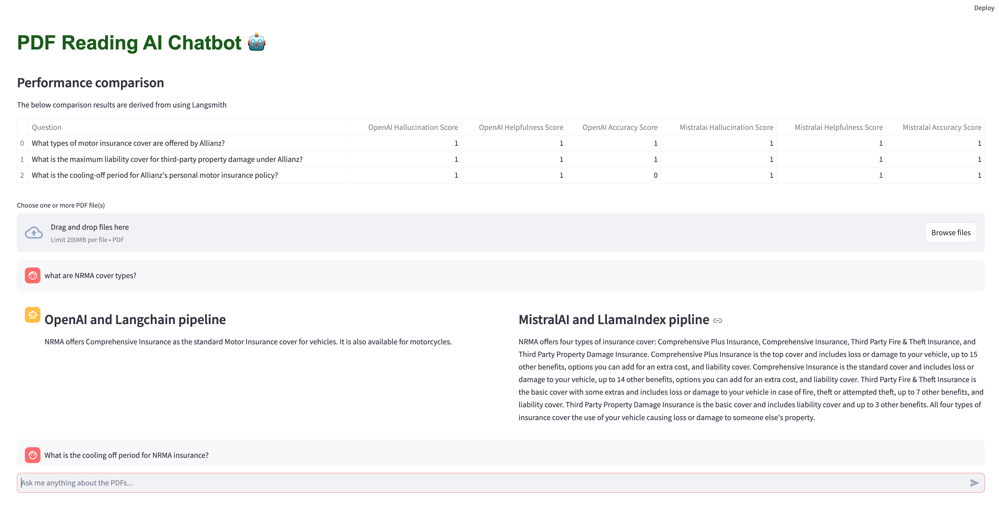

# PDF Reading Chatbot

## Initial setup

Install `python` and `uv` for "Extremely fast Python package installer and resolver, written in Rust"

```
brew install python
brew install uv
brew install poppler

```

## Install dependencies

```
uv sync
```

## Create a local .env file

You will need set up a number of API keys for this to work.
OpenAI and Mistral AI require you to set up a payment plan and add payment credit for the API keys to work.
Once you have the API keys, on your terminal run the below command

```
export OPENAI_API_KEY="YOUR_OPENAI_API_KEY_HERE"
export LANGCHAIN_API_KEY="YOUR_LANGCHAIN_API_KEY"
```

And in your .env file, add the below env vars

```
OPENAI_API_KEY="YOUR_OPENAI_API_KEY"
LANGCHAIN_API_KEY="YOUR_LANGCHAIN_API_KEY"
MISTRALAI_API_KEY="YOUR_MISTRALAI_API_KEY"
DATASET_PATH="/Users/{YOUR_USERNAME}/{PROJECT_DIR}/model/data"
DATASTORE_DIR="/Users/{YOUR_USERNAME}/{PROJECT_DIR}/PersistentDB"
LANGCHAIN_ENDPOINT="https://api.smith.langchain.com"
LANGCHAIN_TRACING_V2="true"
```

- Dataset path is the path to the dataset folder eg. `"/Users/kimstocker/projects/pdf_reading_chatbot/model/data"`
- Datastore is the PersistentDB path eg.`"/Users/kimstocker/projects/pdf_reading_chatbot/model/PersistentDB"`

# Run app

```
uv run streamlit run app.py --server.port=8510
```

A browser window should open with the app. Ask a question about NRMA and ANZ insurance policy. Summary table will show on top of the page

<!-- It already has the example PDFs loaded, but you can try uploading your own PDFs and ask questions about them. -->

# App images


